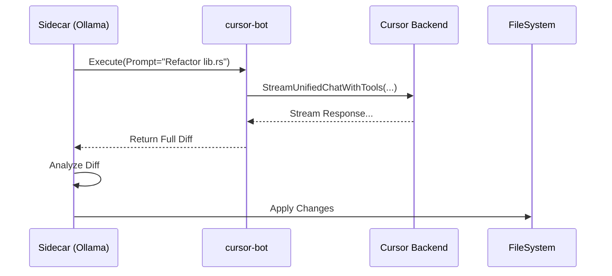

# Cursor TUI & Headless Client Architecture

**Date**: 2026-01-03
**Status**: Design / RFC
**Related**: `../research/HEADLESS_CURSOR_FEASIBILITY.md`, `../research/CONTEXT_MANAGEMENT_STRATEGY.md`

## 1. Vision

To create a high-performance, headless Rust client (`cursor-tui`) that interfaces directly with the Cursor AI backend (`api2.cursor.sh`). This decouples the AI capabilities from the Electron resource-heavy UI, enabling:

1. **Terminal Interface**: A blazing fast, keyboard-centric UI (Ratatui) for interacting with Cursor AI.
2. **Agent Swarms**: Running 10-50 parallel automated sessions for regression testing or complex task solving.
3. **Local AI Orchestration**: A local "Sidecar" agent (Ollama) driving the remote Cursor AI.

## 2. Architecture

The project is structured as a Rust workspace with three crates:

```
tools/cursor-tui/
├── Cargo.toml              # Workspace definition
├── cursor-core/            # Library: Protocol, Auth, Networking
├── cursor-tui/             # Binary: Ratatui Interface
└── cursor-bot/             # Binary: Headless Automation/Swarm
```

### 2.1. `cursor-core` (The Library)

This is the heart of the operation. It handles the reverse-engineered gRPC-Web protocol.

* **Auth Module**:
  * Reads `state.vscdb` (copied to temp) to extract `cursorAuth/cachedTokens`.
  * Extracts `machineId` and `macMachineId`.
  * *Challenge*: If `x-cursor-checksum` is needed, we implement a "Harvester" (see Section 3).

* **Proto Module**:
  * Contains generated Rust structs from `aiserver.v1.proto`.
  * Handles serialization/deserialization (Prost).

* **Client Module**:
  * HTTP/2 client (`h2` or `reqwest` + `rustls`).
  * Implements `StreamUnifiedChatWithTools`.
  * Handles the custom framing (5-byte gRPC header).

### 2.2. `cursor-tui` (The Interface)

A rich TUI built with **Ratatui**.

* **Views**:
  * `ChatView`: Scrollable history of User/Bot messages. Markdown rendering.
  * `InputView`: Vim-style editing mode.
  * `ContextView`: Tree view of selected files/docs.
* **State Management**: `ratatui-wgpu` or standard crossterm backend. Async event loop.

### 2.3. `cursor-bot` (The Automator)

A CLI tool for running headless tasks.

* **Usage**: `cursor-bot run --prompt-file task.txt --instances 5`
* **Output**: JSON logs of the conversation.
* **Integration**: Can be called by a Local LLM (Sidecar) to execute tasks.

## 3. The Authentication Challenge

The primary blocker identified in `HEADLESS_CURSOR_FEASIBILITY.md` is `x-cursor-checksum`.

**Findings from Proxy Research**:
> "We successfully injected content while forwarding the original checksum. This implies the checksum validates the Headers/Auth, NOT the full Body integrity."

**Strategy A: The Harvester (Immediate)**

1. We run a lightweight "Harvester" extension or proxy alongside the real Cursor app.
2. It captures valid `x-cursor-checksum` + `Authorization` pairs.
3. It writes them to `~/.cursor-tui/auth_pool.json`.
4. `cursor-tui` consumes these tokens. Since they aren't bound to the *exact* body content (proven by injection success), we can reuse them for new requests within their validity window.

**Strategy B: Reversal (Long Term)**
Reverse-engineer the JS obfuscation to generate checksums locally. (High effort, brittle).

## 4. Local AI "Sidecar" Integration

`cursor-tui` will expose a local API (or file-based interface) for the Sidecar.



## 5. Roadmap

### Phase 1: PoC (Week 1)

- [ ] `cursor-core`: Connect to `api2.cursor.sh` using hardcoded/captured headers.
* [ ] `cursor-core`: Send a simple "Hello" and print the response stream.
* [ ] Prove we can start a *new* conversation without the Electron app.

### Phase 2: TUI (Week 2)

- [ ] Basic Ratatui interface.
* [ ] Input and output streaming.
* [ ] Markdown parsing in terminal.

### Phase 3: The Swarm (Week 3)

- [ ] Implement `cursor-bot`.
* [ ] Parallel execution.
* [ ] "Sidecar" API integration.

## 6. Implementation Details

### Dependencies

```toml
[dependencies]
tokio = { version = "1", features = ["full"] }
ratatui = "0.26"
crossterm = "0.27"
prost = "0.12"
h2 = "0.3"
rustls = "0.21"
sqlite = "0.30" # For reading state.vscdb
```
