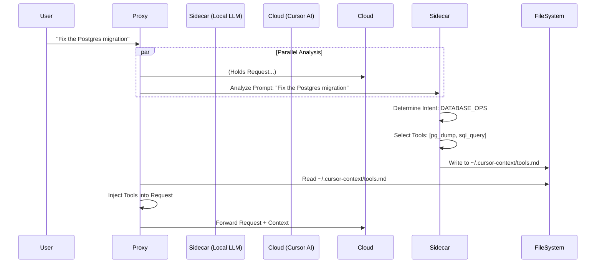

# Context Management & Sidecar Architecture

**Status**: Draft
**Objective**: Prevent context collapse and enable dynamic, smart tool injection via a local Sidecar Agent.

## 1. Context Collapse Mitigation

Injecting unlimited files leads to the "Lost in the Middle" phenomenon where LLMs ignore instructions buried in large contexts.

### Strategy: The Context Budget

We define a **Soft Limit** (e.g., 20k tokens) for injected content. The Proxy (or Sidecar) acts as a scheduler.

| Priority | Content Type | Strategy |
|:---:|---|---|
| **P0** | **System Instructions** | Always injected. Defines constraints (e.g., "Don't delete files"). |
| **P1** | **Active Task Context** | Derived from recent messages. Injected as "Current Focus". |
| **P2** | **Dynamic Tool Definitions** | Only tools relevant to the P1 context. |
| **P3** | **Reference Files** | Documentation/Code. **Summarized** before injection if > 2k tokens. |

## 2. The "Sidecar" Agent Architecture

Instead of burdening the Proxy with AI logic, we offload "Thinking" to a local Sidecar (e.g., Ollama running Qwen/Llama).

### Benefits
1.  **Latency Hiding**: The Sidecar runs fast on local GPU.
2.  **Context Hygiene**: Cloud LLM never sees irrelevant tools, reducing hallucinations.
3.  **Cost**: Zero cost for the "Selection" step.

## 3. Implementation Plan

1.  **File Watcher**: Proxy watches `~/.cursor-context/*.md` for real-time updates.
2.  **Sidecar Script**: A Python script (`tools/sidecar.py`) that:
    *   Tails the proxy log.
    *   Calls `http://localhost:11434/api/generate` (Ollama).
    *   Updates context files based on the response.

